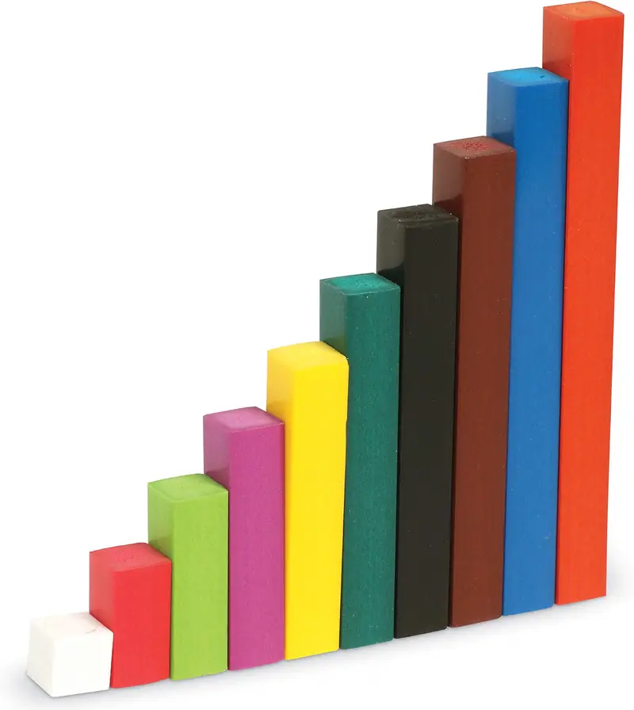

# Палочки Кюизенера

## Названия инструмента

- **Русский:** палочки Кюизенера, цветные счетные палочки, «числа в цвете».
- **Английский:** Cuisenaire rods.
- **Немецкий:** Cuisenaire-Stäbchen, farbige Rechenstäbchen.

## Происхождение и название

Инструмент назван в честь бельгийского учителя начальных классов Жоржа Кюизенера, который изобрел его в середине
XX века. Название «числа в цвете» восходит к его книге «Les nombres en couleurs» (1952). Широкую известность палочкам
принес математик и педагог Калеб Гаттеньо.

В повседневной речи их часто называют просто «счетными палочками», что иногда приводит к путанице. Обычные пластиковые
счетные палочки из канцелярского магазина имеют одинаковую длину и служат для поштучного пересчета. Палочки
Кюизенера — это система пропорциональных брусков разного цвета и длины, в которой каждый брусок изображает число
целиком.

## Суть и концепция инструмента

### Длина равна значению

Каждое число от 1 до 10 представлено гладким бруском определенного цвета и строго заданной длины: от 1 см для единицы
до 10 см для десятки. Сечение у всех брусков одинаковое, 1 × 1 см. На брусках принципиально нет насечек или
делений — это отучает ребенка пересчитывать элементы по одному пальцем.

Цвета в классическом наборе: 1 — белый, 2 — красный, 3 — светло-зеленый, 4 — фиолетовый, 5 — желтый, 6 — темно-зеленый,
7 — черный, 8 — коричневый, 9 — синий, 10 — оранжевый. У некоторых производителей, в том числе в российских наборах,
цвета отличаются, поэтому примеры ниже даны по классической раскраске.

### Состав числа

Это эталонный инструмент для визуализации состава числа (англ. number bonds). Ребенок физически видит и проверяет
опытным путем, что рядом с желтым бруском (5) можно впритык положить красный (2) и светло-зеленый (3) — их общая длина
совпадет идеально.

### Переход к дробям и уравнениям

Поскольку числа представлены как монолитные объекты разной длины, палочки формируют понимание пропорций. Ребенок легко
усваивает отношения «больше/меньше на…» и закладывает интуитивный фундамент для будущей работы с дробями: один брусок
составляет ровно половину или треть другого (красный — половина фиолетового, светло-зеленый — треть синего).

Задача «какой брусок нужно приложить к красному, чтобы получился желтый» — это уже прототип уравнения 2 + x = 5.