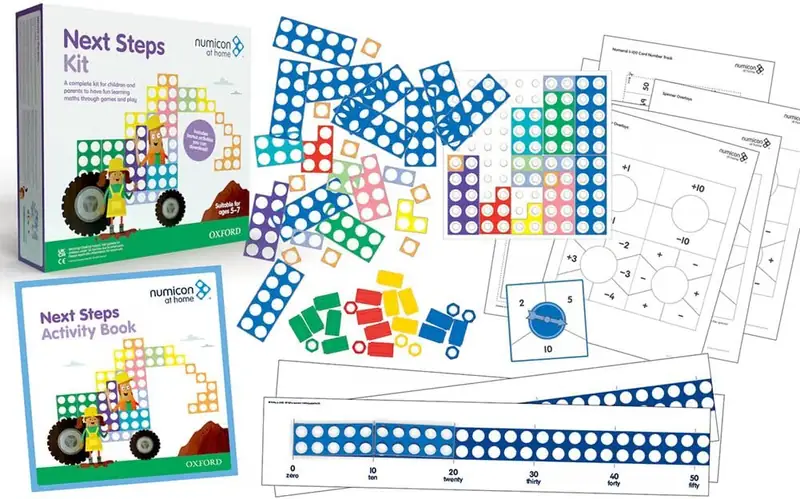

# Нумикон (Numicon)

## Названия инструмента

- **Русский:** Нумикон, фигуры Нумикона.
- **Английский:** Numicon, Numicon shapes.
- **Немецкий:** Numicon, Numicon-Formen.

## Происхождение и название

Нумикон — британская методика и торговая марка. Ее разработали в середине 1990-х учителя Рут Аткинсон и Роми Тейкон
вместе с преподавателем математики Тони Уингом из Брайтонского университета в рамках исследования, финансируемого
Teacher Training Agency. Сейчас материалы Нумикона выпускает издательство Oxford University Press.

В отличие от счетов или десятичных рамок, у этого инструмента нет «народных» названий: во всех странах, включая Германию
и Россию, его называют брендовым словом Numicon.

Домашний набор Numicon at Home Next Steps Kit («Следующие шаги») рассчитан на возраст 5–7 лет и хорошо ложится
в концепцию `basic-math`: сложение, вычитание, переход через десяток.

## Главное отличие от десятичных рамок

Отверстия в Нумиконе тоже расположены попарно, как в сетке 2 × N. Визуально фигуры похожи на заполненные десятичные
рамки, но физическая механика принципиально другая.

Десятичная рамка — это пустой «гараж», куда ребенок по одной загоняет «машины» (фишки). Число 7 там собирается из семи
отдельных фишек.

Нумикон — монолитная деталь. Число 7 — одна розовая пластинка с семью отверстиями. Ребенку не нужно отсчитывать 7 фишек:
он просто берет в руку саму семерку. Число обретает вес, размер и неизменную форму.

Цвета фигур: 1 — оранжевый, 2 — светло-голубой, 3 — желтый, 4 — светло-зеленый, 5 — красный, 6 — бирюзовый, 7 — розовый,
8 — ярко-зеленый, 9 — фиолетовый, 10 — синий. Они не совпадают с цветами палочек Кюизенера: например, желтый
у Кюизенера — это 5, а у Нумикона — 3.

## Суть и концепция инструмента

### Наглядная четность

Все четные числа (2, 4, 6, 8, 10) выглядят как ровные прямоугольники. У всех нечетных (1, 3, 5, 7, 9) есть выступающий
«хвостик». Если попросить ребенка сложить две нечетные фигуры (например, 3 и 5), он составит их так, что два хвостика
образуют ровный край. Ребенок видит и чувствует руками правило: нечетное + нечетное = четное.

### Состав числа как пазл

Чтобы показать, что 8 состоит из 5 и 3, вы берете красную пятерку, прикладываете к ней желтую тройку, а сверху
накрываете ярко-зеленой восьмеркой. Фигуры совпадут идеально, отверстие к отверстию. Это работает как конструктор.

### Вес числа

Вес фигуры соответствует ее числу: фигура «10» весит столько же, сколько фигуры «7» и «3» вместе. Если положить
их на чашечные весы, они уравновесятся. Это дает ребенку еще один, кинестетический канал восприятия равенства — прообраз
уравнения. Для таких заданий у Нумикона есть отдельные весы (Numicon Pan Balance); в набор Next Steps они не входят.

### Колышки и базовая доска

В наборе Next Steps есть 24 цветных колышка (pegs) и базовая доска (baseboard) 10 × 10. Колышки вставляются в отверстия,
на доске раскладывают фигуры и строят узоры, а 10 дополнительных фигур-десяток позволяют работать с числами до 100.
По описанию издателя, набор охватывает не только сложение и вычитание, но и умножение, деление и дроби. Это делает
Нумикон гораздо более многогранным инструментом, чем плоские десятичные рамки.
