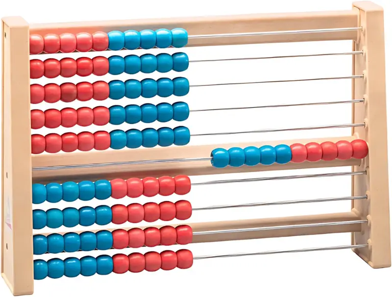

# Рекенрек (счеты на 100 бусин)

## Названия инструмента

- **Русский:** рекенрек, школьные счеты на 100, детские классические счеты; разговорно — «стосчеты».
- **Английский:** Rekenrek, 100-bead abacus, arithmetic rack (math rack).
- **Немецкий:** Rechenrahmen, Hunderterrahmen; версия на 20 бусин — Zwanzigerrahmen.

## Не путать с соробаном

Эти счеты категорически не стоит путать с японским **соробаном** (рус. соробан / англ. soroban / нем. japanischer
Soroban). В России именно соробан в последние годы стали массово называть «абакусом» из-за маркетинга школ ментальной
арифметики.

У соробана другая конструкция: 1 костяшка сверху и 4 снизу на каждой спице. Обучение на нем строится на заученных
формулах дополнения и мысленной визуализации счетов (анзан). Сам соробан тоже десятичный и позиционный (каждая
спица — разряд), но его алгоритмы расходятся со школьными: ребенок применяет готовые формулы вместо понимания состава
числа.

## Происхождение и название

Методическое название — **рекенрек** (нидерл. Rekenrek, «счетная рамка»). Его придумал Адри Трефферс во Фройденталевском
институте (Утрехт, Нидерланды) в начале 1990-х специально для младших школьников.

Оригинальный рекенрек — это 20 бусин: два ряда по 10. Версия на 100 бусин (10 рядов по 10) — расширение той же идеи.
Сами классные счеты на 100 бусин существовали в школах и раньше; новшество рекенрека — цветовое деление 5/5 и методика,
при которой бусины двигают группами, а не по одной.

В русскоязычном пространстве удобно говорить **рекенрек** или **школьные счеты на 100**. «Стосчеты» — не устоявшийся
термин, но короткое название, которое сразу отсекает ассоциации с ментальной арифметикой.

## Суть и концепция инструмента

### Опора на пятерку

Главная особенность рекенрека — цветовое разделение каждого ряда ровно пополам (например, 5 красных бусин и 5 белых).
В версии на 100 бусин цвет часто меняется и после пятого ряда, чтобы глазом было видно и 50.

### Распознавание количества по структуре

Благодаря цветам ребенок перестает считать бусины поштучно («один, два, три…») и привыкает видеть количество целиком:
7 воспринимается как блок из пяти бусин одного цвета и двух бусин другого.

Мгновенное узнавание без счета (**субитизация**; англ. subitizing; нем. Simultanerfassung) работает только примерно
до 4. Узнавание больших чисел через структуру («7 — это 5 и 2») называется **концептуальной субитизацией** (англ.
conceptual subitizing; нем. quasi-simultane Anzahlerfassung). Именно для нее нужна опора на пятерку: без цветового
деления количество больше 4 глазом не схватить.

### Наглядность десятичной системы

Рекенрек работает в той же логике, что и арифметика первых классов. Он позволяет физически потрогать и увидеть состав
десятка, понять алгоритм перехода через десяток при сложении и научиться считать круглыми десятками до ста.

Для состава десятка и перехода через десяток достаточно двух рядов (формат оригинального рекенрека на 20). Остальные
ряды на этом этапе можно закрыть листом бумаги, чтобы не отвлекали.