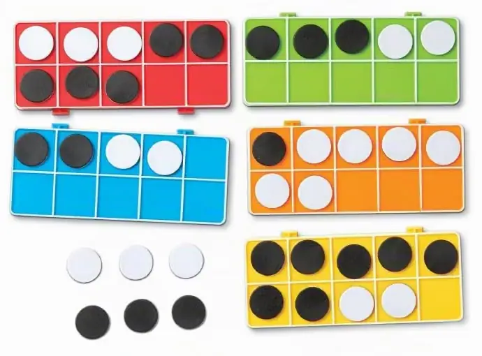

# Десятичные рамки (ten frames)

## Названия инструмента

- **Русский:** десятичные рамки, рамки-десятки; разговорно — «рамки с фишками».
- **Английский:** ten frame; две рамки для счета до 20 — double ten frame.
- **Немецкий:** Zehnerfeld (мн. ч. Zehnerfelder); две рамки для счета до 20 — Zwanzigerfeld.

## Происхождение и название

Считается, что рамку предложил американский педагог Роберт Вирц в 1970-х. Широкую популярность она приобрела благодаря
современным подходам к обучению: ее используют в сингапурской математике, которая считается одной из самых сильных
в мире, а также в начальной школе в США, Австралии и Германии.

Физически это карточка или пластиковая основа в виде прямоугольника, разделенного на два горизонтальных ряда по пять
ячеек. В ячейки выкладывают двусторонние кружочки, пуговицы, монеты или любые другие мелкие предметы.

## Суть и концепция инструмента

### Опора на числа 5 и 10

Как и у рекенрека, структура 2 × 5 учит видеть количество по структуре, а не пересчитывать его (концептуальная
субитизация). Ребенок быстро запоминает паттерны: если верхний ряд заполнен, а в нижнем лежат две фишки — это 7; если
в рамке пустует ровно одна ячейка — это 9. Пересчитывать предметы по одному больше не нужно.

Паттерны работают, только если рамку всегда заполняют в одном порядке: сначала верхний ряд слева направо, затем нижний.

### Состав числа

Выкладывая в пустую рамку фишки двух разных цветов (например, красные и синие), ребенок физически конструирует состав
числа 10 (англ. number bonds). Он видит комбинации: 8 красных и 2 синих, 6 красных и 4 синих и так далее. Рамка служит
жестким ограничителем: в нее помещается ровно десять фишек, а пустые ячейки сразу показывают, сколько не хватает
до десяти.

### Переход через десяток

Это, пожалуй, самый наглядный инструмент для объяснения сложения вида 8 + 5. У ребенка есть одна рамка с 8 красными
фишками и вторая, пустая. Нужно прибавить 5 синих фишек. Ребенок видит в первой рамке ровно две пустые ячейки
и перекладывает туда две синие фишки, завершая десяток. Оставшиеся 3 синие фишки отправляются во вторую рамку. Итог
визуально очевиден: одна полная рамка (10) и еще 3 фишки дают 13.

Прием, который иначе приходится объяснять абстрактно, здесь становится понятным физическим действием.